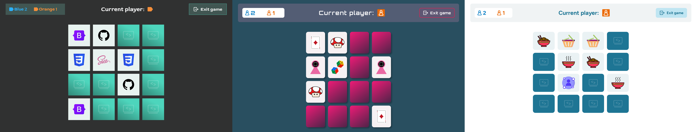

# Memory

A two-player memory card game with three visual themes and selectable
board sizes. Built with TypeScript, SCSS and Vite, without a framework.

**Live:** https://payitahtlabs.github.io/memory-app/



## Features

- Three themes (Code vibes, Gaming, DA Projects), each with its own
  color scheme, typography and card motifs
- Board sizes 4×4, 4×6 and 6×6
- Two players taking turns; the selected player color starts
- 3D card-flip animation; mismatched pairs turn back automatically
  after one second, then the turn passes
- Score and current-player display, exit dialog with confirmation
- Game-over screen announcing the winner or a draw
- Last settings are remembered between rounds (localStorage)
- Fonts are hosted locally; the app makes no external requests

## Tech Stack

- **TypeScript** (strict) for game logic, state and DOM rendering
- **SCSS** with a 7-1-inspired structure and BEM class names; themes
  are defined once as a Sass map and compiled into CSS custom properties
- **Vite** as dev server and production bundler
- No framework, no runtime dependencies; the toolchain was configured
  by hand rather than scaffolded

## Getting Started

Requires Node.js 22.

```bash
git clone https://github.com/Payitahtlabs/memory-app.git
cd memory-app
npm install
npm run dev
```

| Script | Description |
| --- | --- |
| `npm run dev` | Dev server with hot module replacement |
| `npm run build` | Type check (`tsc --noEmit`) and production build to `dist/` |
| `npm run preview` | Serve the production build locally |

## Project Structure

```
src/
├── main.ts                # entry point, owns all screen transitions
├── types.ts               # shared types and literal contracts
├── game.ts                # game state and rules, module-private state
├── card.ts                # Card class
├── homescreen.ts          # one module per screen: rendering decisions
├── settings.ts            #   and event wiring
├── game-screen.ts
├── game-over-screen.ts
├── *-templates.ts         # markup templates, no logic
├── assets/                # card motifs, icons, fonts, game-over art
└── styles/
    ├── abstract/          # variables, mixins, theme map
    ├── base/              # reset, fonts, theme generator
    └── components/        # one BEM block per file
```

## Architecture Notes

- Single-page app: one `index.html`, screens are swapped by render
  functions. `main.ts` is the only module that knows the transitions.
- Rendering decisions (labels, asset URLs, theme branches) live in the
  screen modules; the `*-templates.ts` files only assemble markup from
  finished values.
- Theming: the `$themes` map in `abstract/_themes.scss` generates
  `body[data-theme]` blocks with CSS custom properties. Component styles
  consume those variables and never contain theme colors themselves.
- Board clicks go through a single delegated listener; after each move
  the DOM is updated in place, so listeners and flip transitions survive.
- Timers live in the screen layer; `game.ts` stays synchronous.

## Deployment

Every push to `main` builds and deploys to GitHub Pages via GitHub
Actions (`.github/workflows/deploy.yml`). `vite.config.ts` sets
`base: "/memory-app/"` for production builds only, so the dev server
keeps running at the root.

## Background

Solo project from the Developer Akademie frontend curriculum, written
to the DA coding conventions (max. 14 lines per function, explicit
return types, TSDoc, BEM). After several projects without any tooling,
this was my first with a build setup, configured manually to
understand what each part of the chain does.

The visual design and all card artwork belong to Developer Akademie and
are used here for training purposes only. The source code is published
for review but not released under an open-source license.
